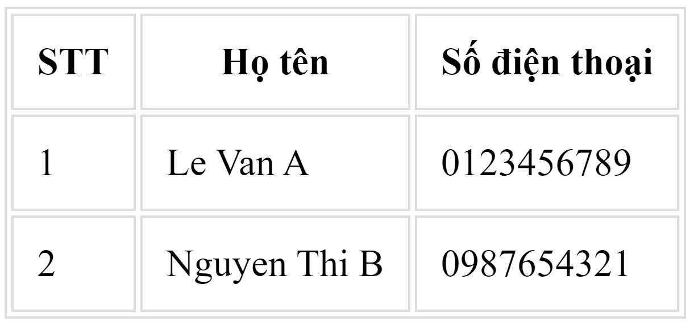

# HTML CHEATSHEET

## Tag

1.  <code>Link</code>
    ```html
    <a href="url">Text</a>
    ```

    - **target**: thuộc tính xác định nơi mà tài liệu được mở.
      - `_self`: Mặc định. Mở tài liệu ở tab hiện tại.
      - `_blank`: Mở tài liệu trong tab mới.
    - **title**: Thông tin bổ sung về một element.

2.  <code>Img</code>
    ```html
    
    ```
    - **src** (source): Chèn đường dẫn ảnh
    - **alt** (alternate): Văn bản thay thế cho hình ảnh khi đường dẫn ảnh bị lỗi.
3.  <code>Video</code>
    ```html
    <video width="320" height="240" controls>
      <source src=“link-video.mp4" type="video/mp4">
    </video>
    ```
    - **width/height**: Chiều rộng và chiều cao của video. Nếu không để width/height thì web có thể bị nhấp nháy trong khi tải video.
    - **controls**: Thuộc tính điều khiển, như là bật, tạm dừng, âm lượng
    - **loop**: Lặp lại video
    - **src**: Đường dẫn video
    - **type**: Kiểu video (mp4, ogg, webm)
    - **autoplay**: Tự động phát video
    - **muted**: Tắt tiếng
4.  <code>Audio</code>
    ```html
    <audio controls><source src=“link-audio.mp3" type="audio/mpeg"></audio>
    ```
    - **controls**: Thuộc tính điều khiển, như là bật, tạm dừng, âm lượng
    - **loop**: Lặp lại audio
    - **src**: Đường dẫn audio
    - **type**: Kiểu video (Ví dụ: mpeg - là mp3, ogg, webm, wav)
    - **autoplay**: Tự động phát audio
    - **muted**: Tắt tiếng
5. <code>Table</code>:
    ```html
    <table>
        <thead>
            <tr>
                <th>STT</th>
                <th>Họ tên</th>
                <th>Số điện thoại</th>
            </tr>
        </thead>
        <tbody>
            <tr>
                <td>1</td>
                <td>Le Van A</td>
                <td>0123456789</td>
            </tr>
            <tr>
                <td>2</td>
                <td>Nguyen Thi B</td>
                <td>0987654321</td>
            </tr>
        </tbody>
    </table>
    ```
    - `<table></table>`: Xác định một bảng
    - `<thead></thead>`: Phần đầu của bảng
    - `<tbody></tbody>`: Phần thân của bảng
    - `<tr></tr>` (table row):  Xác định một hàng của bảng
    - `<th></th>` (table header): Xác định tiêu đề của bảng
    - `<td></td>` (table data): Xác định dữ liệu ô của bảng

    **Output:**

    


6. <code>List</code>  
    ```html
    <ul>
        <li>Mục 1</li>
        <li>Mục 2</li>
        <li>Mục 3</li>
    </ul>
    ```
    - **`<ul></ul>`**: Danh sách hiển thị kiểu không được đánh số.
    - **`<li></li>`**: Một mục trong danh sách.
    - **`<ol></ol>`**: Các mục con của nó được sắp xếp theo thứ tự bằng số hoặc chữ cái.
        + **Thuộc tính dành riêng cho thẻ `<ol></ol>`**:
            * **type="1"**: Mặc định. Các mục trong danh sách sẽ được đánh dưới dạng số.
            * **type="A"**: Các mục trong danh sách sẽ được đánh dưới dạng chữ hoa.
            * **type="a"**: Các mục trong danh sách sẽ được đánh dưới dạng chữ thường.
            * **type="I"**: Các mục trong danh sách sẽ được đánh dưới dạng số La Mã viết hoa.
            * **type="i"**: Các mục trong danh sách sẽ được đánh dưới dạng số La Mã viết thường.
7. <code>Iframe</code>
    ```html
    <iframe src="url" title="description" height="200" width="300"></iframe>
    ```
8. <code>Form</code>
    ```html
    <form action="">
        <label for="fullName">Họ tên:</label><br>
        <input type="text" id="fullName" name="full_name"><br>
        <label for="email">Email:</label><br>
        <input type="text" id="email" name="email"><br><br>
        <input type="submit" value="Gửi">
    </form>
    ```
    - **action**: Đường dẫn xử lý khi gửi form.
    - **target**: Nơi hiển thị phản hồi sau khi gửi.
    - **method**: Phương thức gửi (GET hoặc POST):
        + **GET**: Dữ liệu gắn vào URL, không bảo mật, giới hạn 2048 ký tự.
        + **POST**: Dữ liệu không hiển thị URL, không giới hạn kích thước.
9. <code>Select</code>
    ```html
    <select name="tên_thuộc_tính" id="id_thuộc_tính">
        <option value="giá_trị_1">Tùy chọn 1</option>
        <option value="giá_trị_2">Tùy chọn 2</option>
        <option value="giá_trị_3">Tùy chọn 3</option>
    </select>
    ```
    - **name**: Tên của danh sách, dùng để nhận giá trị khi gửi form.
    - **id**: Định danh cho thẻ `<select>`.
    - **value** (trong `<option>`): Giá trị được gửi khi tùy chọn được chọn.
    - **selected**: Đặt mặc định cho một tùy chọn.
    - **disabled**: Vô hiệu hóa tùy chọn

## Block
- Một số thẻ dạng block:

    `<address>, <article>, <aside>, <blockquote>, <canvas>, <dd>, <div>, <dl>, <dt>, <fieldset>, <figcaption>, <figure>, <footer>, <form>, <h>, <header>, <hr>, <li>, <main>, <nav>, <noscript>, <ol>, <p>, <pre>, <section>, <table>, <tfoot>, <ul>.`
- Một số thẻ dạng inline:

    `<a>, <abbr>, <acronym>, <b>, <bdo>, <big>, <br>, <button>, <cite>, <code>, <em>, <i>, , <input>, <kbd>, <label>, <map>, <object>, <output>, <q>, <samp>, <script>, <select>, <small>, <span>, <strong>, <sub>, <sup>, <textarea>, <time>, <tt>, <var>.`
